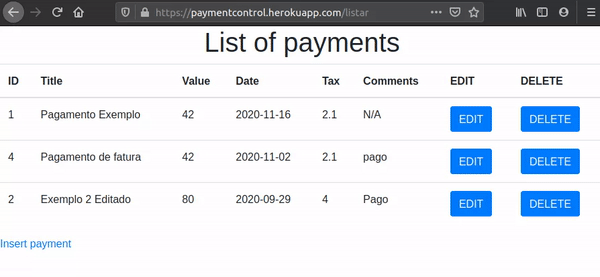
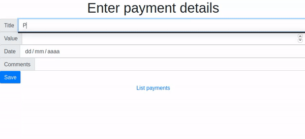
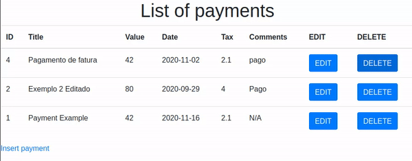

<h1 align="center">Welcome to PaymentControl 👋</h1>
<p>
  <a href="#" target="_blank">
    
  </a>
    
  <a href="https://twitter.com/mrlucasrib" target="_blank">
    
  </a>
</p>

> PaymentControl is a simple payment management system. It allows you to create, update, remove and list all payments. **It also allows importing a spreadsheet with data.**

### ✨ [Demo](https://paymentcontrol.herokuapp.com/inserir)

## :rocket: Technologies

This project was developed with the following technologies:

- 
- 
- 

## 💻 Project Screen





## :information_source: How To Use

### Prerequisites
- Docker
### Usage
From your command line:

```sh
# Clone repository
git clone https://github.com/mrlucasrib/PaymentControl.git
cd PaymentControl
# Install Docker if you do not have
docker-compose up -d
```

## Author

👤 **Lucas Ribeiro**

* Twitter: [@mrlucasrib](https://twitter.com/mrlucasrib)
* Github: [@mrlucasrib](https://github.com/mrlucasrib)
* LinkedIn: [@mrlucasrib](https://linkedin.com/in/mrlucasrib)

## :memo: License

This project is under the AGPL v3 license. See the [LICENSE](LICENSE) for details.

## Show your support

Give a ⭐️ if you liked this project!
